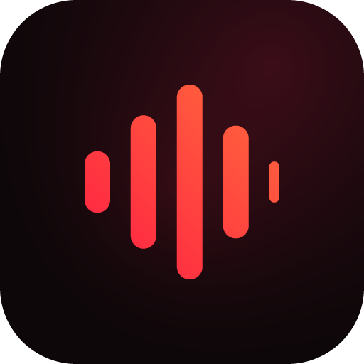
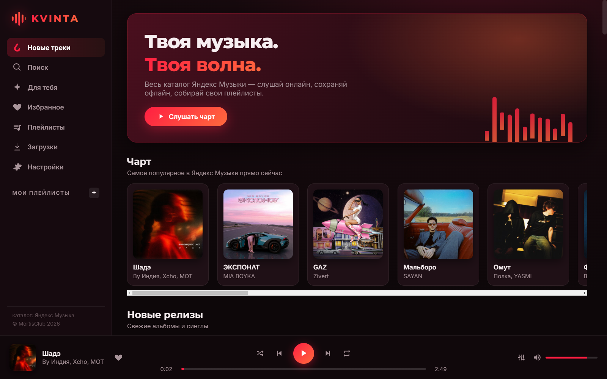
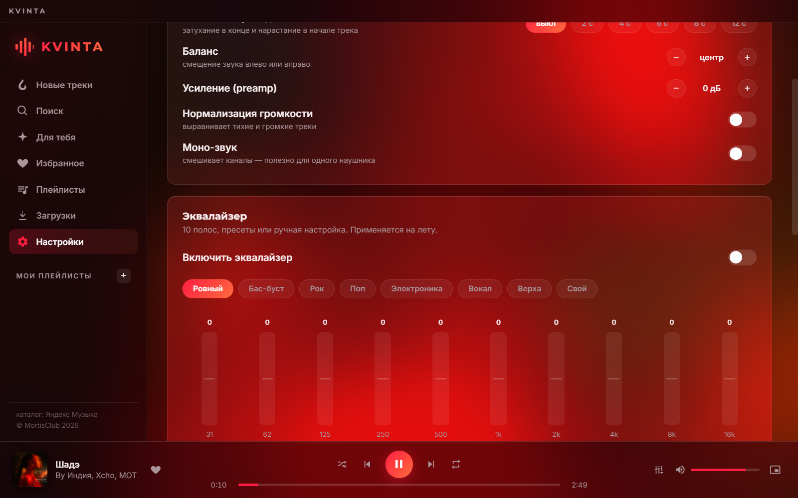
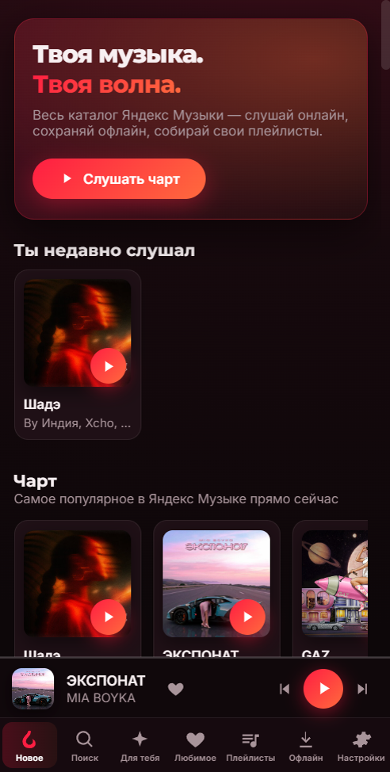
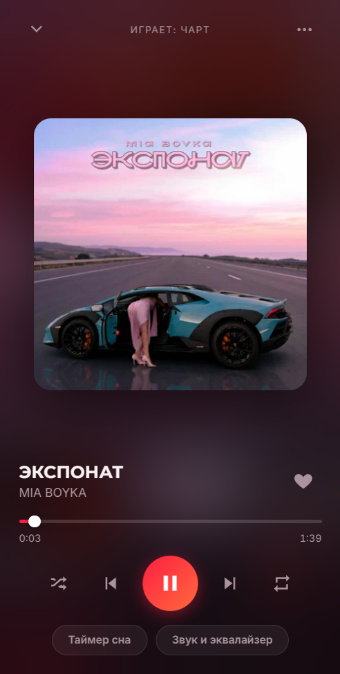
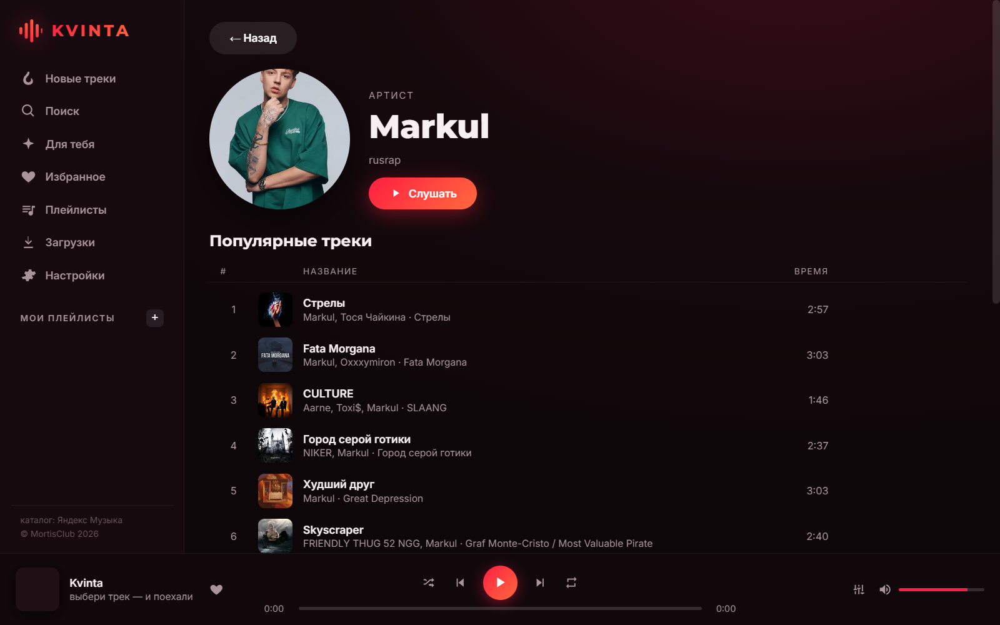

<p align="center">
  
</p>

<h1 align="center">Kvinta</h1>

<p align="center">
  Локальный музыкальный сервис в фирменном красном стиле.<br>
  Весь каталог Яндекс Музыки — слушай онлайн, сохраняй офлайн, собирай свои плейлисты.
</p>

<p align="center">
  
  
  
</p>

---

## Скриншоты

<p align="center">
  
</p>
<p align="center">
  
</p>
<p align="center">
  
  &nbsp;&nbsp;
  
</p>

## Что нового в 1.0.1

Добавил карточки музыкантов — открываются по клику на имя артиста в любом списке или из поиска:

<p align="center">
  
</p>

Ещё в этой версии: поиск ищет сразу по трекам, артистам и альбомам, починено создание плейлистов, а на Android обновление качается с прогресс-баром и ставится по кнопке.

## Что умеет

- чарт, новые релизы, поиск по трекам/артистам/альбомам, персональные подборки, история прослушиваний
- избранное и свои плейлисты, карточки артистов
- загрузка треков для офлайна (на ПК — в папку `Музыка\Kvinta`)
- 10-полосный эквалайзер с пресетами, скорость, баланс, моно, нормализация, preamp, плавные переходы
- таймер сна
- медиаклавиши, шторка и экран блокировки на Android
- автообновление: ПК ставит новые версии сам, Android предлагает свежий APK

## Запуск на ПК

Двойной клик по `Kvinta.bat` — при первом запуске сам поставит зависимости.

## Мобильная версия

В `mobile/` лежит Capacitor-обёртка над тем же кодом:

```
node mobile/sync.js
```

после этого открыть `mobile/android` в Android Studio и собрать APK.

На телефоне трек с включённой обработкой звука сначала качается целиком и играет из blob, иначе Web Audio глушит кросс-доменный поток. Поэтому старт с эквалайзером чуть дольше.

## Как устроено

- `main.js`, `preload.js` — Electron: окно, IPC, прокси `kvs://` для Web Audio, загрузки
- `renderer/` — весь интерфейс, правится тут
- `mobile/www/` — копия renderer плюс `native.js` (мост на Capacitor) и `mobile.css`
- `tools/release.js` — выпуск версии: `node tools/release.js 1.0.1 "что нового"`
- `tools/make-icons.js` — генерит иконки, `tools/shot.js` — скриншоты для ридми

<p align="center">© MortisClub 2026</p>
